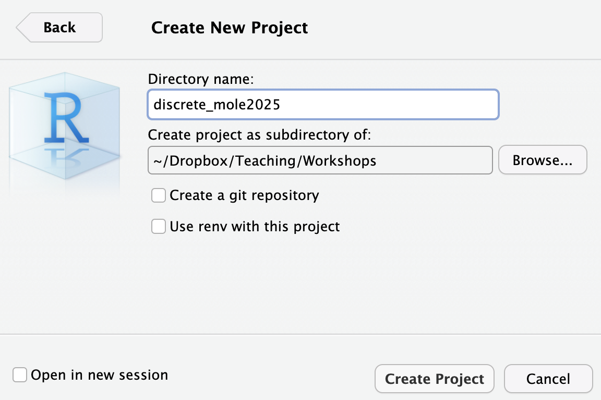

## Installing require packages

```
#Ape- basic visualization and some phylogenetic comparative methods
#install.packages("ape")

# Phytools- broad visualization and comparative methods package
#install.packages("phytools")

#Advanced visualization
#if (!require("BiocManager", quietly = TRUE))
    #install.packages("BiocManager")

#BiocManager::install("treeio")

#install.packages("devtools")
#library(devtools)
#install_github("YuLab-SMU/ggtree")
```
# A Brief R refresher

## Motivation

R is a statistical programming environment with many built-in mathematical functions and many others that are found in packages that can be installed. 

Analyses in R are performed using a series of commands which are written in script files and passed to the main console. The general workflow is:

1. Create a project by doing Files> Open new project > New directory > New project
2. Name your project a something memorable like bio508_practicals and save it in a location where it will be safe. See image below

3. Download practical files (when applicable) in that exact folder and everything should work smoothly

## Some basic commands

Like any programming language, one must learn its syntax. Over time one learns the commands in R, and how to string them together into meaningful operations. Here are some basic commands:

Assign a value to a variable

```
# Check the notation
a <- 3
a

b = 4
b
```

Combine values into a vector (i.e., array) using the `c` function

```
b <- c(3,4,5)   # What does c() mean?
b
```


Items in a vector can be accessed by calling their position using the `[]` operators. Note that the first element in a vector is assigned position `1`. 

```
b[2]	
```

Combine objects into a list using the `list` function

```
l <- list(number = 3, values = c(3.5, 4, 12), message = "many things can go in a list")  
l
```

Items in a list can be accessed by calling their position using the `[[]]` operator, or by calling their name using the `$` operator.

```
l[[3]] 
l$message
```

R provides functions for generating random deviates from several different parametric distributions. For example, we can draw a single random value uniformly from the interval (0,1):

```
x <- runif(1) 
x
```

The `rnorm` function lets us draw from a normal distribution. We can draw 50 values from a normal distribution with a mean of 5 and a standard deviation of 1:

```
a <- rnorm(50,5,1) 
```

We can use the `plot()` function to view a simple scatter plot of values in a vector.

```
plot(a)   
```

And the `hist()` function shows us a histogram of our vector

```
hist(a)     
```

There are also several built-in functions that allow us to compute summary statistics of a vector:

```
mean(a)
median(a)
var(a)
```

Finally, you can look at the help for any function by calling `?`

```
?var
```

## Working with trees using the _ape_ Package

The _ape_ package provides a structure for storing a phylogenetic tree, as well as basic manipulation and plotting functions. The _ape_ structure is used by most R packages which deal with phylogenetic trees, so it is important to understand it. Then,  load it into the environment. _ape_ is distributed by CRAN, the main package repository for R.

```
#It is not sufficient with installing it, you need to load it
library(ape)
```

### The tree object

_ape_ provides functions for simulating random trees with a fixed number of tips, `rcoal` (for ultrametric trees) and `rtree`. These functions can be useful for testing code on a small example, which is what we are going to do here.

```
tree <- rcoal(5)
```

Let's take a look at what exactly _ape_ created when we asked for a tree:

```{r}
tree
```

This tree is of class ``phylo``:

```
class(tree)
```


Most phylogenetic packages require ``phylo`` objects as input.


By opening the tree object in the RStudio environment panel, we can see that this object is in fact a list of several components. The list of these components can also be accessed using the `names` function.

```
names(tree)
```


Now we will check how the computer enumerates nodes and tips

The computer internally enumerates the nodes and we can see this

```
library(phytools)
plotTree(tree=tree, offset=1)
tiplabels()
nodelabels()
```


Try to figure out what the following parts of the phylo object mean.

 * `tree$edge` 

 * `tree$edge.length` 

 * `tree$tip.label`

 * `tree$Nnode` 
 
 * optionally, there can also be a `tree$node.label` vector which contains labels for all the internal nodes, in the same order as their indices in the `edge` matrix (so if an internal node has index ntips+5, its label is at position 5 in `tree$node.label`).
 
Most of the time, it is not necessary to directly edit the structure of `phylo` objects, as the _ape_ package and others provide functions to manipulate trees.


## Reading and writing trees

In order to interface with other software, or reuse data, we need to be able to input trees from a file, and in reverse to output trees to a file.
_ape_ supports two formats for input/output of trees, the Newick and the Nexus format. Let's write our example tree to a Newick file:

```
write.tree(tree, file = "newick.tre")
```

Opening the file `newick.tre` shows that the tree has been written as a Newick string. We can read that file again into the R environment:

```
newick_tree <- read.tree("newick.tre")
```

Opening both `tree` and `newick_tree` in the environment panel of RStudio shows that they are indeed the same tree.
Similarly, we can write our tree to a Nexus file,

```
write.nexus(tree, file = "nexus.nex")
```

as well as read it back in.

```
nexus_tree <- read.nexus("nexus.nex")
```

Again, this tree is identical to the original.

### Plotting trees

Visualizing trees is another useful function provided by the _ape_ package. By default, trees are plotted as phylograms, with tip labels:

```
plot(tree)
```


Other options are available, such as coloring the edges

```
plot(tree, edge.color = rainbow(8))
```


or other types of plots.

```
par(mfrow=c(1,2))
plot(tree, type = "cladogram")
plot(tree, type = "radial")
```

### Other useful functions

Some other _ape_ functions that can be useful are:

 * the `getMRCA` function returns the index of the most recent common ancestor of a group of tips.
 
```
getMRCA(tree, c("t1", "t3"))
```

 * the `node.depth.edgelength` function calculates the depth of each node using the edge lengths.
 
```
node.depth.edgelength(tree)
```


Note that these are depths, i.e. the root is at d=0. In order to obtain the times, with the present at t=0, the values need to be reversed.

```
depths <- node.depth.edgelength(tree)
max(depths) - depths
```

## Rotating nodes

We write phylogenies in the computer in a format called *Newick*. The Newick format is a way of representing phylogenetic trees with branches using parentheses and commas. It was adopted by James Archie, William H. E. Day, Joseph Felsenstein, Wayne Maddison, Christopher Meacham, F. James Rohlf, and David Swofford, at two meetings in 1986, the second of which was at Newick's restaurant in Dover, New Hampshire, US where they ate lobster.


Let's use it to create a litte vertebrate tree

```
newick.format =
    "(((((((cow, pig),whale),(bat,(lemur,human))),(robin,iguana)),coelacanth),gold_fish),shark);"
vert.tree = read.tree(text=newick.format)

plot(vert.tree,no.margin=TRUE,edge.width=2)
```
*  Try your hand at rotating human and lemurs
*  Rotate the node where ancestor of pig and whale
*  Rotate the node where ancestor of iguana and whale is 
*  Who are humans most closely related to cows or whales?
*  Who are humans most closely related to whales or coelecanth? 


It was super annoying to rotate the iguana and whale node right? But if we have numbers we can do this easier.

```
plotTree(vert.tree, offset=1)
tiplabels()
nodelabels()

rt.iguanawhale<-rotateNodes(vert.tree, 15)
plotTree(rt.iguanawhale, offset=1)
tiplabels()
nodelabels()
```

## Pretty visualization with _ggtree_

Check the full ggtree vignette [here](https://guangchuangyu.github.io/ggtree-book/chapter-ggtree.html)

Now let's run some publication quality phylogenies

```
library(ggtree)
set.seed(2025-09-09)
tree <- rtree(50)
ggtree(tree)
```

Everything is possible
```
ggtree(tree, layout="slanted") 

ggtree(tree, layout="circular")

ggtree(tree, layout="fan", open.angle=120)

ggtree(tree, layout="equal_angle")

ggtree(tree, layout="daylight")

ggtree(tree, branch.length='none')

ggtree(tree, branch.length='none', layout='circular')

ggtree(tree, layout="daylight", branch.length = 'none')
```

Let's observe a true phylogeny of Flu!

```
#install.packages("ips")
library("ips")
beast_file <- system.file("examples/MCC_FluA_H3.tree", 
                          package="ggtree")
beast_tree <- read.beast(beast_file)
ggtree(beast_tree, mrsd="2013-01-01") + theme_tree2()
```

## Collapsing nodes

Collapsing nodes can be very useful when you are trying to visualize a MRCA or a clade

```
nwk <- system.file("extdata", "sample.nwk", package="treeio")
tree <- read.tree(nwk)
p <- ggtree(tree) + geom_tiplab()

### Check this
p2 <- p %>% collapse(node=21) + 
  geom_point2(aes(subset=(node==21)), shape=21, size=5, fill='green')

p2

p2 <- collapse(p2, node=23) + 
  geom_point2(aes(subset=(node==23)), shape=23, size=5, fill='red')
  
p2

expand(p2, node=23) %>% expand(node=21)
```

## Finding our way to the MRCA and rotations

We can also visualize reading phylogenies

```
tree2 <- groupOTU(tree,.node=c(1,7))
ggtree(tree2, aes(color=group)) + geom_tiplab()


p1 <- p + geom_point2(aes(subset=node==16), color='hotpink', size=5)
p2 <- rotate(p1, 17) %>% rotate(21)
flip(p2, 17, 21)
p2
```

## Ancestral Pokemon

Want to put Pokemon in a phylogeny?  You can!

Let's  figure out what this does!
```
tree <- read.nexus("https://raw.githubusercontent.com/rgriff23/Dissertation/master/Chapter_2/data/tree.nex")
pg <- ggtree(tree)  
d <- data.frame(node = c(70,89,96,110,113,124),
                images = c("https://i.imgur.com/8VA9cYw.png",
                            "https://i.imgur.com/XYM1T2x.png",
                            "https://i.imgur.com/EQs5ZZe.png",
                            "https://i.imgur.com/2xin0UK.png",
                            "https://i.imgur.com/hbftayl.png",
                            "https://i.imgur.com/3wDHW8n.png"))
pg %<+% d + geom_nodelab(aes(image=images), geom="image")
```
